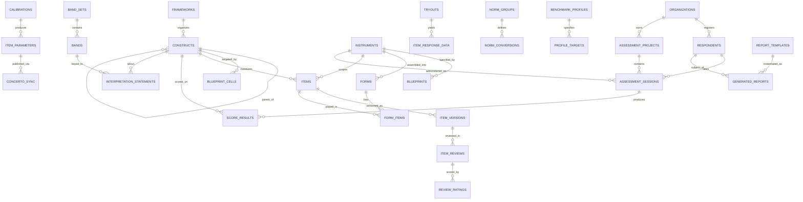

# Skema Arsitektur Data Terpadu — Sistem Asesmen
### Item Development · Item Bank · Delivery (Concerto) · Pelaporan
**Stack:** Laravel + Filament (aplikasi inti) · R (kalibrasi & skoring) · Concerto (delivery/CAT)
**Konteks:** pendidikan (seleksi + diagnostik) dan korporat (seleksi + manajemen talenta)

Dokumen ini menggabungkan *Skema Item Development & Item Bank* dan *Skema Lapisan Pelaporan* menjadi satu rancangan basis data utuh yang siap diimplementasikan. Entitas bersama didefinisikan sekali, dan tabel diurutkan mengikuti dependensi foreign key (lihat §7 untuk urutan migrasi).

---

## 0. Cakupan & alur besar

Sistem menutup seluruh pipeline: **pengembangan konstruk → penulisan & reviu item → tryout → kalibrasi → bank item → sinkronisasi ke Concerto → administrasi → skoring → norma → interpretasi → laporan.**

```
[HULU: Pengembangan]                    [DELIVERY]           [HILIR: Pelaporan]
frameworks → constructs → blueprints
    → instruments → forms → items
    → reviu (validitas isi)
    → tryout → kalibrasi (IRT/CTT/DIF)
    → item_parameters (is_operational)
        → concerto_sync ──────────────→ Concerto ──────────→ score_results (θ, SEM)
                                        (CAT/polyCAT/linear)      → norma → band
                                                                   → interpretasi
                                                                   → rekomendasi
                                                                   → generated_reports
```

---

## 1. Prinsip desain terpadu

1. **Item & konten interpretif adalah entitas berversi.** Perubahan menghasilkan versi baru; entitas operasional selalu menunjuk versi tertentu, riwayat tak pernah hilang.
2. **Pemisahan tiga hal:** (a) *konten* (item, teks interpretasi), (b) *parameter/pemetaan* (parameter IRT, norma, cut-score), (c) *skor* (θ, SEM). Ketiganya berversi independen.
3. **Provenance & snapshot.** Kalibrasi menyimpan jejak sampel/model/perangkat; laporan yang digenerasi bersifat *immutable* dan mengunci versi norma/teks yang dipakai.
4. **Bukti, bukan asumsi.** Validitas isi (Aiken's V/CVR/I-CVI), fit item, DIF, dan dimensionalitas disimpan sebagai bukti terstruktur; status `published`/`approved` adalah kesimpulan berbasis bukti.
5. **Presisi selalu dilaporkan.** Tidak ada skor tanpa SEM/pita; perbandingan antar-domain/antar-waktu memakai *reliable change/difference*.
6. **Dukungan keputusan, bukan otomasi.** Cut-score & rekomendasi adalah masukan; keputusan akhir manusia tercatat terpisah.
7. **Satu sumber kebenaran.** `constructs`, `instruments`, `items` didefinisikan sekali (Bagian B) dan dirujuk lapisan pelaporan; tata kelola (reviu, versi, audit) dibagikan seluruh sistem.
8. **Multi-tenant & multi-audiens.** Satu skor dapat menghasilkan laporan berbeda untuk peserta, pendidik/HR, dan pengambil keputusan, dengan kontrol akses berbeda.

---

## 2. Peta arsitektur



Sepuluh bagian: **A** Fondasi & Tata Kelola · **B** Pengembangan Item · **C** Reviu & Validitas Isi · **D** Tryout & Psikometri · **E** Bank & Sinkronisasi Concerto · **F** Subjek & Sesi · **G** Norma & Standar · **H** Bank Interpretasi & Rekomendasi · **I** Profil Acuan & Komposit · **J** Perakitan & Snapshot Laporan.

---

## 3. Konvensi implementasi

- **Primary key** `id` bigint auto-increment; **foreign key** `<entitas>_id`.
- **`timestamps`** = `created_at` + `updated_at` (Laravel default) pada semua tabel; tambahkan `deleted_at` (soft delete) pada entitas konten (item, interpretasi, rekomendasi, template, norma).
- **Versioning & status:** paket `spatie/laravel-model-states`. Konten pendek memakai daur `draft→review→approved→retired`; **item** memakai daur penuh 10-status (§5).
- **Audit menyeluruh:** `spatie/laravel-activitylog` untuk semua entitas.
- **Enum** disimpan sebagai string pendek (bukan integer) demi keterbacaan migrasi & query.
- **JSON** dipakai untuk struktur yang fleksibel/bersarang (parameter, konfigurasi, snapshot) — indeks pada kolom JSON bila sering di-query.
- **Multi-tenant:** `organization_id` pada entitas milik klien; entitas pustaka bersama boleh `null`.

---

# BAGIAN A — Fondasi & Tata Kelola (bersama)

### `organizations`
| Kolom | Tipe | Catatan |
|---|---|---|
| id | bigint PK | |
| name | string | |
| type | enum(`education`,`corporate`) | default bahasa/disclaimer |
| settings | json | branding, kop, kebijakan retensi |
| timestamps | | |

> `users`, `roles`, `permissions` diasumsikan mengikuti pola Laravel + `spatie/laravel-permission`; peran minimal: penulis, reviewer-1, reviewer-2, panelis, psikometrikus, admin-proyek, viewer (audience-scoped).

### `reviews` (polimorfik — konten interpretif/rekomendasi/norma/template)
Untuk reviu **item** dipakai tabel khusus `item_reviews` (Bagian C) karena butuh rating validitas isi; entitas konten lain memakai tabel polimorfik ini.

| Kolom | Tipe | Catatan |
|---|---|---|
| id | bigint PK | |
| reviewable_type / reviewable_id | morphs | menunjuk interpretation/recommendation/norm/template |
| reviewer_id | FK users | |
| stage | enum(`review_1`,`review_2`,`panel`) | |
| decision | enum(`approve`,`revise`,`reject`) | |
| ratings | json nullable | rating terstruktur (opsional) |
| comments | text | |
| created_at | timestamp | |

---

# BAGIAN B — Pengembangan Item

### `frameworks`
| Kolom | Tipe | Catatan |
|---|---|---|
| id | bigint PK | |
| name | string | |
| description | text | |
| theoretical_basis | text | landasan teori/rujukan |
| context | enum(`education`,`corporate`,`both`) | |
| version / status | | |
| timestamps | | |

### `constructs` *(sumber kebenaran — dirujuk lapisan pelaporan)*
| Kolom | Tipe | Catatan |
|---|---|---|
| id | bigint PK | |
| framework_id | FK nullable | |
| parent_id | FK nullable → constructs.id | hierarki konstruk→dimensi→indikator |
| level | enum(`construct`,`dimension`,`indicator`) | |
| code | string | key stabil (mis. `NUM.EST`) |
| name | string | |
| conceptual_definition | text | |
| operational_definition | text | |
| direction | enum(`unidimensional`,`index`) nullable | ekspektasi dimensionalitas |
| version / status | | |
| timestamps | | |

### `instruments` *(sumber kebenaran — dirujuk `assessment_sessions`)*
| Kolom | Tipe | Catatan |
|---|---|---|
| id | bigint PK | |
| organization_id | FK nullable | null = pustaka bersama |
| name | string | |
| purpose | enum(`selection`,`diagnostic`,`talent_mgmt`) | |
| response_model | enum(`dichotomous`,`polytomous`,`mixed`) | |
| default_irt_model | enum(`rasch`,`2pl`,`3pl`,`4pl`,`grm`,`pcm`) | selaras node Concerto |
| delivery_default | enum(`linear`,`cat`,`polycat`,`questionnaire`) | |
| version / status | | |
| timestamps | | |

### `blueprints` (kisi-kisi)
| Kolom | Tipe | Catatan |
|---|---|---|
| id | bigint PK | |
| instrument_id | FK | |
| name | string | |
| version / status | | |

### `blueprint_cells`
| Kolom | Tipe | Catatan |
|---|---|---|
| id | bigint PK | |
| blueprint_id | FK | |
| construct_id | FK | |
| cognitive_level | string nullable | mis. Bloom C1–C6 |
| target_item_count | int | |
| target_difficulty_min / max | decimal nullable | rentang b (θ-skala) |
| weight | decimal | |

### `forms`
| Kolom | Tipe | Catatan |
|---|---|---|
| id | bigint PK | |
| instrument_id | FK | |
| name | string | |
| form_type | enum(`linear`,`cat_pool`,`mst`) | |
| is_operational | boolean | |
| version / status | | |

### `items` *(membawa status siklus hidup — §5)*
| Kolom | Tipe | Catatan |
|---|---|---|
| id | bigint PK | |
| instrument_id | FK nullable | null = item tingkat-bank |
| primary_construct_id | FK | indikator/dimensi yang diukur |
| item_type | enum(`mc`,`likert`,`vas`,`grid`,`short_answer`,`long_answer`,`ordering`) | |
| scoring_type | enum(`dichotomous`,`polytomous`,`unscored`) | |
| base_language | string(5) | mis. `id` |
| status | enum(`draft`,`review_1`,`review_2`,`revision`,`panel`,`approved`,`tryout`,`calibrated`,`published`,`retired`) | |
| current_version_id | FK → item_versions | |
| exposure_limit | decimal nullable | kendali eksposur high-stakes |
| sensitivity_flags | json nullable | isu fairness/sensitif |
| author_id | FK users | |
| timestamps | | |

### `item_versions`
| Kolom | Tipe | Catatan |
|---|---|---|
| id | bigint PK | |
| item_id | FK | |
| version_no | int | |
| stem | text | |
| instruction | text nullable | |
| content | json | struktur tambahan (skala Likert, grid) |
| status_at_version | string | |
| changed_by | FK users | |
| change_note | text | |
| created_at | timestamp | |

### `item_options`
| Kolom | Tipe | Catatan |
|---|---|---|
| id | bigint PK | |
| item_version_id | FK | |
| code | string | `A`/`B`… atau kategori Likert |
| order_index | int | |
| score_value | decimal | skor kategori (politomus/parsial) |
| is_key | boolean | kunci (dikotomus/MC) |

### `item_translations`
| Kolom | Tipe | Catatan |
|---|---|---|
| id | bigint PK | |
| item_version_id | FK | |
| language | string(5) | |
| stem | text | |
| options | json | terjemahan opsi |
| translator_id | FK users nullable | |
| review_status | enum(`draft`,`reviewed`,`approved`) | |

### `item_media`
| Kolom | Tipe | Catatan |
|---|---|---|
| id | bigint PK | |
| item_version_id | FK | |
| type | enum(`image`,`audio`,`video`,`attachment`) | |
| path | string | |
| alt_text | string nullable | aksesibilitas |

### `item_tags`
| Kolom | Tipe | Catatan |
|---|---|---|
| id | bigint PK | |
| item_id | FK | |
| taxonomy | string | `curriculum`/`competency`/`cognitive` |
| value | string | |

---

# BAGIAN C — Reviu & Validitas Isi

### `item_reviews`
| Kolom | Tipe | Catatan |
|---|---|---|
| id | bigint PK | |
| item_version_id | FK | |
| reviewer_id | FK users | |
| stage | enum(`review_1`,`review_2`,`panel`,`translation`) | |
| decision | enum(`approve`,`revise`,`reject`) | |
| comments | text | |
| created_at | timestamp | |

### `review_ratings`
| Kolom | Tipe | Catatan |
|---|---|---|
| id | bigint PK | |
| item_review_id | FK | |
| criterion | enum(`relevance`,`clarity`,`representativeness`,`difficulty_est`,`fairness`) | |
| rating | tinyint | skala mis. 1–4/1–5 |

### `content_validity_indices`
| Kolom | Tipe | Catatan |
|---|---|---|
| id | bigint PK | |
| item_id | FK | |
| index_type | enum(`aiken_v`,`cvr`,`i_cvi`) | |
| value | decimal | |
| n_raters | int | |
| criterion | string nullable | |
| panel_round | string | |
| computed_at | timestamp | |

### `item_status_transitions`
| Kolom | Tipe | Catatan |
|---|---|---|
| id | bigint PK | |
| item_id | FK | |
| from_status / to_status | string | |
| actor_id | FK users | |
| note | text nullable | |
| created_at | timestamp | |

---

# BAGIAN D — Tryout & Psikometri

### `tryouts`
| Kolom | Tipe | Catatan |
|---|---|---|
| id | bigint PK | |
| instrument_id | FK | |
| form_id | FK nullable | |
| name | string | |
| purpose | enum(`pilot`,`calibration`,`equating`) | |
| sample_definition | json | |
| planned_n / achieved_n | int | |
| conducted_at | date | |
| concerto_project_ref | string nullable | |

### `item_response_data`
| Kolom | Tipe | Catatan |
|---|---|---|
| id | bigint PK | |
| tryout_id | FK | |
| item_id | FK | |
| item_version_id | FK | |
| respondent_ref | string | anonim/pseudonim |
| response | string | |
| score | decimal nullable | |
| response_time_ms | int nullable | |
| demographics | json nullable | untuk DIF |

### `calibrations` *(inti provenance)*
| Kolom | Tipe | Catatan |
|---|---|---|
| id | bigint PK | |
| instrument_id | FK | |
| tryout_id | FK | |
| model | enum(`rasch`,`2pl`,`3pl`,`4pl`,`grm`,`pcm`) | |
| software | string | mis. `mirt 1.4x` |
| analyst_id | FK users | |
| n_sample | int | |
| dimensionality_summary | json | |
| global_fit | json | |
| status | enum(`draft`,`reviewed`,`accepted`,`rejected`) | |
| calibrated_at | timestamp | |

### `item_parameters` (IRT) *(dikonsumsi Concerto & skoring)*
| Kolom | Tipe | Catatan |
|---|---|---|
| id | bigint PK | |
| item_id | FK | |
| calibration_id | FK | |
| a / b / c / d | decimal nullable | diskriminasi/kesulitan/tebakan/upper |
| thresholds | json nullable | ambang politomus (GRM/PCM) |
| se_params | json | galat baku parameter |
| item_fit | json | infit/outfit atau S-X² |
| scale_link | string nullable | identitas skala/penautan |
| is_operational | boolean | parameter yang dipublikasikan ke bank |

### `item_statistics` (CTT)
| Kolom | Tipe | Catatan |
|---|---|---|
| id | bigint PK | |
| item_id | FK | |
| calibration_id | FK | |
| p_value | decimal | tingkat kesukaran |
| item_total_corr | decimal | rpbis/rbis |
| distractor_analysis | json | |
| n | int | |

### `dif_analyses`
| Kolom | Tipe | Catatan |
|---|---|---|
| id | bigint PK | |
| item_id | FK | |
| calibration_id | FK | |
| grouping_variable | string | `sex`/`region`/`school_type` |
| method | enum(`mantel_haenszel`,`logistic`,`irt_lr`) | |
| statistic | decimal | |
| effect_size | decimal | mis. ΔMH |
| flag | enum(`A`,`B`,`C`) nullable | tingkat DIF |

### `dimensionality_analyses`
| Kolom | Tipe | Catatan |
|---|---|---|
| id | bigint PK | |
| instrument_id | FK | |
| calibration_id | FK nullable | |
| method | enum(`efa`,`cfa`,`parallel`,`bifactor`) | |
| indices | json | CFI, RMSEA, ω, dsb. |
| conclusion | text | |

### `linking_equating`
| Kolom | Tipe | Catatan |
|---|---|---|
| id | bigint PK | |
| from_calibration_id / to_calibration_id | FK | |
| method | enum(`mean_mean`,`mean_sigma`,`stocking_lord`,`haebara`,`concurrent`) | |
| constants | json | A, B |
| anchor_item_ids | json | |

---

# BAGIAN E — Bank & Sinkronisasi Concerto

> **Bank item** = query item berstatus `published`/`calibrated` dengan `item_parameters.is_operational = true`. Tidak ada tabel bank terpisah; sinkronisasi dicatat di bawah.

### `concerto_sync` *(snapshot parameter ke Concerto)*
| Kolom | Tipe | Catatan |
|---|---|---|
| id | bigint PK | |
| item_id | FK nullable | |
| form_id | FK nullable | |
| concerto_data_table | string | nama Data Table tujuan |
| parameter_snapshot | json | a,b,c,d/ambang yang dikirim |
| item_version_id | FK | versi konten yang dikirim |
| calibration_id | FK | sumber parameter |
| sync_status | enum(`pending`,`synced`,`failed`,`superseded`) | |
| synced_at | timestamp nullable | |
| synced_by | FK users | |

### `exposure_tracking`
| Kolom | Tipe | Catatan |
|---|---|---|
| id | bigint PK | |
| item_id | FK | |
| times_administered | int | |
| last_used_at | timestamp | |
| exposure_rate | decimal | |

---

# BAGIAN F — Subjek & Sesi (jembatan dari Concerto)

### `respondents`
| Kolom | Tipe | Catatan |
|---|---|---|
| id | bigint PK | |
| organization_id | FK | |
| external_ref | string | no. peserta/NIM/NIP |
| type | enum(`student_applicant`,`student`,`employee_applicant`,`employee`) | |
| full_name | string | |
| sex | enum(`M`,`F`,`other`) nullable | pencocokan norma & audit DIF |
| dob | date nullable | |
| email | string nullable | |
| demographics | json | wilayah/sekolah/unit/jenjang/job family |
| consent_at | timestamp nullable | |
| timestamps | | |

### `assessment_projects`
| Kolom | Tipe | Catatan |
|---|---|---|
| id | bigint PK | |
| organization_id | FK | |
| name | string | |
| context | enum(`education`,`corporate`) | |
| purpose | enum(`selection`,`diagnostic`,`talent_mgmt`) | |
| default_norm_group_id | FK nullable | |
| starts_at / ends_at | date | |
| config | json | |
| timestamps | | |

### `assessment_sessions`
| Kolom | Tipe | Catatan |
|---|---|---|
| id | bigint PK | |
| respondent_id | FK | |
| project_id | FK | |
| instrument_id | FK | |
| concerto_session_ref | string | id sesi Concerto |
| concerto_test_id | string nullable | |
| delivery_mode | enum(`linear`,`cat`,`polycat`,`questionnaire`) | |
| status | enum(`assigned`,`in_progress`,`completed`,`invalidated`) | |
| started_at / finished_at | timestamp nullable | |
| response_ref | json/string | lokasi respons item-level |
| timestamps | | |

### `score_results` *(batas serah-terima dari skoring)*
| Kolom | Tipe | Catatan |
|---|---|---|
| id | bigint PK | |
| session_id | FK | |
| construct_id | FK | |
| method | enum(`ctt_sum`,`irt_2pl`,`irt_3pl`,`irt_grm`,`irt_pcm`) | konsisten dgn `calibrations.model` |
| raw_score | decimal nullable | |
| theta | decimal nullable | |
| sem | decimal nullable | **wajib bila IRT** |
| se | decimal nullable | untuk CTT |
| n_items | int | |
| marginal_reliability | decimal nullable | |
| engine_ref | string nullable | sebaiknya menunjuk `calibration_id` |
| computed_at | timestamp | |

---

# BAGIAN G — Norma & Standar

### `norm_groups`
| Kolom | Tipe | Catatan |
|---|---|---|
| id | bigint PK | |
| name | string | mis. "SMA kelas 12 Nasional 2025" |
| population_definition | json | |
| n_size | int | |
| reference_date | date | |
| version / status | | `draft`/`active`/`retired` |
| owner_id | FK users | |
| timestamps | | |

### `norm_conversions`
| Kolom | Tipe | Catatan |
|---|---|---|
| id | bigint PK | |
| norm_group_id | FK | |
| construct_id | FK | |
| input_type | enum(`raw`,`theta`) | |
| norm_type | enum(`lookup_table`,`linear`,`area_transform`) | |
| params | json nullable | untuk linear/area transform |
| output_scales | json | percentile/z/T/stanine/sten/scaled |
| timestamps | | |

### `norm_conversion_rows` *(hanya untuk `lookup_table`)*
| Kolom | Tipe | Catatan |
|---|---|---|
| id | bigint PK | |
| norm_conversion_id | FK | |
| input_value | decimal | |
| percentile / z_score / t_score / scaled_score | decimal nullable | |
| stanine / sten | tinyint nullable | |

### `band_sets`
| Kolom | Tipe | Catatan |
|---|---|---|
| id | bigint PK | |
| construct_id | FK nullable | null = generik |
| name | string | |
| basis | enum(`norm_percentile`,`t_score_range`,`theta_range`,`criterion`) | |
| context | enum(`education`,`corporate`,`both`) | |
| version / status | | |

### `bands`
| Kolom | Tipe | Catatan |
|---|---|---|
| id | bigint PK | |
| band_set_id | FK | |
| label | string | "Tinggi"/"Mahir" |
| code | string | key stabil untuk dirujuk teks |
| order_index | tinyint | |
| color | string nullable | |

### `band_thresholds`
| Kolom | Tipe | Catatan |
|---|---|---|
| id | bigint PK | |
| band_id | FK | |
| min_value / max_value | decimal nullable | sesuai `basis` |
| min_inclusive / max_inclusive | boolean | |

### `cut_scores`
| Kolom | Tipe | Catatan |
|---|---|---|
| id | bigint PK | |
| project_id | FK nullable | |
| scope | enum(`construct`,`composite`) | |
| construct_id / composite_definition_id | FK nullable | |
| cut_value | decimal | |
| value_basis | enum(`raw`,`theta`,`scaled`,`percentile`) | |
| decision_label | string | "Direkomendasikan"/"Cadangan"/"Tidak" |
| rationale | text | dasar standard setting |
| set_by | FK users | |
| version / status | | |

---

# BAGIAN H — Bank Interpretasi & Rekomendasi

### `interpretation_rules` *(multivariat/profil)*
| Kolom | Tipe | Catatan |
|---|---|---|
| id | bigint PK | |
| name | string | |
| description | text | |
| expression | json | pohon logika kondisi antar-konstruk |
| scope_construct_ids | json | |
| priority | int | |
| context | enum(`education`,`corporate`,`both`) | |
| version / status | | |

### `interpretation_statements`
| Kolom | Tipe | Catatan |
|---|---|---|
| id | bigint PK | |
| scope | enum(`construct`,`composite`,`profile`) | |
| construct_id / composite_definition_id | FK nullable | |
| band_id | FK nullable | pemetaan univariat |
| interpretation_rule_id | FK nullable | pemetaan multivariat |
| audience | enum(`candidate`,`educator`,`hr`,`decision_maker`) | |
| language | string(5) | |
| title | string nullable | |
| body | text | mendukung placeholder `{{skor}}`, `{{persentil}}` |
| context | enum(`education`,`corporate`,`both`) | |
| version / status / author_id / approved_by / approved_at | | tata kelola |
| timestamps | | |

### `recommendation_statements`
| Kolom | Tipe | Catatan |
|---|---|---|
| id | bigint PK | |
| scope | enum(`construct`,`composite`,`profile`) | |
| construct_id / composite_definition_id | FK nullable | |
| band_id / interpretation_rule_id | FK nullable | |
| category | enum(`development`,`placement`,`intervention`,`decision_support`) | |
| audience | enum(`candidate`,`educator`,`hr`,`decision_maker`) | |
| language | string(5) | |
| action_text | text | |
| priority | int | |
| context | enum(`education`,`corporate`,`both`) | |
| version / status / author_id / approved_by / approved_at | | |

---

# BAGIAN I — Profil Acuan & Komposit

### `benchmark_profiles`
| Kolom | Tipe | Catatan |
|---|---|---|
| id | bigint PK | |
| organization_id | FK | |
| name | string | "Manajer Cabang"/"Prodi Teknik" |
| context | enum(`education`,`corporate`) | |
| description | text | |
| version / status | | |

### `profile_targets`
| Kolom | Tipe | Catatan |
|---|---|---|
| id | bigint PK | |
| benchmark_profile_id | FK | |
| construct_id | FK | |
| target_min / target_max | decimal | rentang ideal (skala terstandar) |
| direction | enum(`higher_better`,`optimal_range`,`lower_better`) | |
| weight | decimal | |

### `fit_scores`
| Kolom | Tipe | Catatan |
|---|---|---|
| id | bigint PK | |
| respondent_id | FK | |
| session_id | FK nullable | |
| benchmark_profile_id | FK | |
| fit_index | decimal | |
| gap_detail | json | selisih per konstruk |
| computed_at | timestamp | |

### `composite_definitions`
| Kolom | Tipe | Catatan |
|---|---|---|
| id | bigint PK | |
| name | string | |
| context | enum(`education`,`corporate`) | |
| method | enum(`unit_weight`,`weighted_sum`,`mean`,`regression`) | |
| config | json | bobot per komponen |
| scale_out | enum(`z`,`t_score`,`percentile`,`scaled`) | |
| version / status | | |

### `composite_scores`
| Kolom | Tipe | Catatan |
|---|---|---|
| id | bigint PK | |
| respondent_id | FK | |
| composite_definition_id | FK | |
| project_id | FK nullable | |
| value | decimal | |
| scaled_value | decimal nullable | |
| percentile | decimal nullable | |
| band_id | FK nullable | |
| rank_in_cohort | int nullable | seleksi berbasis peringkat |
| snapshot | json | komponen & bobot saat komputasi |
| computed_at | timestamp | |

---

# BAGIAN J — Perakitan & Snapshot Laporan

### `report_templates`
| Kolom | Tipe | Catatan |
|---|---|---|
| id | bigint PK | |
| name | string | |
| context | enum(`education`,`corporate`) | |
| purpose | enum(`selection`,`diagnostic`,`talent_mgmt`) | |
| audience | enum(`candidate`,`educator`,`hr`,`decision_maker`) | |
| layout | enum(`individual`,`group`,`longitudinal`,`decision`) | |
| render_engine | enum(`browsershot`,`dompdf`,`quarto`) | |
| config | json | branding, placeholder diizinkan |
| version / status | | |

### `report_sections`
| Kolom | Tipe | Catatan |
|---|---|---|
| id | bigint PK | |
| report_template_id | FK | |
| type | enum(`cover`,`summary`,`score_profile`,`band_chart`,`precision_note`,`interpretation`,`recommendation`,`fit_profile`,`norm_note`,`longitudinal`,`group_stats`,`disclaimer`) | |
| order_index | int | |
| config | json | konstruk ditampilkan, jenis grafik |

### `generated_reports` *(SNAPSHOT — immutable)*
| Kolom | Tipe | Catatan |
|---|---|---|
| id | bigint PK | |
| respondent_id | FK | |
| session_id | FK nullable | null untuk agregat/longitudinal |
| project_id | FK | |
| report_template_id | FK | |
| template_version | string | |
| audience | enum(...) | |
| snapshot | json | skor+SEM, norm_group+versi, band+versi, id+versi tiap interpretasi/rekomendasi, komposit, fit |
| rendered_path | string nullable | berkas PDF |
| rendered_hash | string nullable | integritas |
| status | enum(`draft`,`final`,`released`,`revoked`) | |
| generated_by | FK users | |
| generated_at | timestamp | |

### `report_access`
| Kolom | Tipe | Catatan |
|---|---|---|
| id | bigint PK | |
| generated_report_id | FK | |
| token | string unik | |
| recipient | string | |
| access_scope | enum(`view`,`download`) | |
| expires_at | timestamp | |
| viewed_at | timestamp nullable | |

### `cohorts` & `cohort_members`
`cohorts`(id, project_id, name, filter json) · `cohort_members`(cohort_id, respondent_id) — untuk laporan kelompok/agregat.

### `change_analyses` *(longitudinal / talenta)*
| Kolom | Tipe | Catatan |
|---|---|---|
| id | bigint PK | |
| respondent_id | FK | |
| construct_id | FK | |
| session_from_id / session_to_id | FK | |
| delta | decimal | |
| sdiff | decimal | galat baku selisih |
| rci | decimal | reliable change index |
| is_reliable | boolean | melampaui galat pengukuran? |
| method | string | mis. Jacobson–Truax |
| computed_at | timestamp | |

---

## 4. Siklus hidup item

```
draft → review_1 ⇄ revision ⇄ review_2 → panel
   [panel: hitung Aiken's V / CVR / I-CVI]
      ├─(validitas isi kurang)→ revision / retired
      └─(memadai)→ approved → tryout
            [tryout: kumpulkan item_response_data]
               → calibrated
                  [item_parameters + item_statistics + dif + dimensionality]
                     ├─(fit/DIF buruk)→ revision / retired
                     └─(memenuhi kriteria)→ published
                           → concerto_sync → operasional
                              └─(drift/bocor/revisi konstruk)→ retired → (rekalibrasi)
```
Setiap panah menulis satu baris `item_status_transitions`. Ambang transisi (Aiken's V pada `panel→approved`; fit/DIF pada `calibrated→published`) ditetapkan sebagai kebijakan aplikasi.

---

## 5. Aliran psikometrik end-to-end

```
item_parameters (is_operational)
   → concerto_sync → Concerto Data Table (CAT/polyCAT/linear)
      → estimasi θ saat administrasi (catR: ML/WL/BM/EAP)
         → score_results (θ, SEM)
            → norm_conversions → band_sets/bands  |  cut_scores
               → composite_definitions | benchmark_profiles→fit_scores
                  → interpretation_statements/rules → recommendation_statements
                     → report_templates/sections → generated_reports (snapshot) → PDF/dasbor
```
Konsistensi wajib: `score_results.method` selaras `calibrations.model`; `score_results.engine_ref` menunjuk `calibration_id`.

---

## 6. Sinkronisasi entitas bersama

| Entitas | Didefinisikan di | Dirujuk oleh |
|---|---|---|
| `constructs` | Bagian B | `score_results`, `norm_conversions`, `band_sets`, `interpretation_statements`, `profile_targets`, `blueprint_cells`, `change_analyses` |
| `instruments` | Bagian B | `assessment_sessions`, `blueprints`, `forms`, `tryouts`, `dimensionality_analyses` |
| `items` / `forms` | Bagian B | `form_items`, `item_*`, `concerto_sync`; ke hilir via `forms→sessions→score_results` |
| Reviu & audit | Bagian A/C | seluruh entitas konten |

---

## 7. Urutan migrasi (dependency-ordered)

Buat migrasi mengikuti urutan ini agar foreign key valid:

1. `organizations`, `users`/`roles`/`permissions` (paket)
2. `frameworks` → `constructs` (self-FK: buat tabel dulu, tambah FK `parent_id` di migrasi terpisah)
3. `instruments` → `blueprints` → `blueprint_cells`
4. `forms`
5. `items` → `item_versions` → (tambah FK `items.current_version_id`) → `item_options`, `item_translations`, `item_media`, `item_tags`
6. `form_items`
7. `item_reviews` → `review_ratings`; `content_validity_indices`; `item_status_transitions`
8. `tryouts` → `item_response_data`
9. `calibrations` → `item_parameters`, `item_statistics`, `dif_analyses`, `dimensionality_analyses`, `linking_equating`
10. `concerto_sync`, `exposure_tracking`
11. `respondents`, `assessment_projects` → `assessment_sessions` → `score_results`
12. `norm_groups` → `norm_conversions` → `norm_conversion_rows`
13. `band_sets` → `bands` → `band_thresholds`
14. `composite_definitions` (sebelum `cut_scores`/`composite_scores`) → `cut_scores`
15. `interpretation_rules` → `interpretation_statements`; `recommendation_statements`
16. `benchmark_profiles` → `profile_targets` → `fit_scores`; `composite_scores`
17. `report_templates` → `report_sections` → `generated_reports` → `report_access`
18. `cohorts` → `cohort_members`; `change_analyses`

> Catatan Laravel: untuk FK melingkar (mis. `items.current_version_id` ↔ `item_versions.item_id`), buat kedua tabel lebih dulu lalu tambahkan constraint via `Schema::table(...)` terpisah.

---

## 8. Catatan Filament

- **Resource hulu:** Framework, Construct (tree), Blueprint, Instrument, Form, Item (editor versi + papan Kanban status), Tryout, Calibration.
- **Resource hilir:** NormGroup, BandSet, Interpretation, Recommendation, BenchmarkProfile, ReportTemplate, GeneratedReport.
- **Relation managers:** item → versi/reviu/parameter/statistik/DIF/transisi; template → sections.
- **Aksi (queue):** kalibrasi (panggil R), sinkronisasi Concerto, generasi PDF massal.
- **Policies:** hak transisi status & akses laporan (audience-scoped) berbeda per peran.
- **Preview laporan** sebagai halaman kustom sebelum status `final`.

---

## 9. Catatan metodologis & etis (kebijakan)

1. **Kecukupan sampel kalibrasi** bergantung model (Rasch hemat; 2PL/GRM lebih menuntut; 3PL/4PL menuntut sampel besar) — terverifikasi lewat `calibrations.n_sample`, bukan diasumsikan.
2. **Asumsi sebelum operasional:** dimensionalitas & independensi lokal diperiksa (`dimensionality_analyses`) sebelum parameter `is_operational`.
3. **Fairness:** DIF diperiksa (`dif_analyses`); item ber-flag berat ditinjau, bukan otomatis dibuang. Untuk seleksi, pantau *adverse impact* memakai `respondents.demographics`.
4. **Presisi:** tidak ada skor tanpa SEM/pita; selisih hanya "berbeda" bila melampaui galat (RCI via `change_analyses`).
5. **Komparabilitas:** skor lintas-form/waktu dijaga `linking_equating`.
6. **Dukungan, bukan otomasi:** `cut_scores`/rekomendasi adalah masukan; keputusan final manusia dicatat terpisah.
7. **Interpretasi berbasis aturan** sebagai tulang punggung; LLM (bila dipakai) hanya memperhalus bahasa konten yang telah disetujui, dengan *human-in-the-loop*.
8. **Perlindungan data:** retensi, minimisasi, dan akses per-audiens selaras regulasi.

---

## 10. Yang perlu diverifikasi sebelum implementasi

- Skema Data Table Concerto aktual → pemetaan `concerto_sync.parameter_snapshot` (kolom a/b/c/d & ambang; format item CAT vs polyCAT).
- Ambang kriteria transisi item (Aiken's V/CVR minimum; kriteria fit/DIF) — ditetapkan bersama tim.
- Metode *standard setting* untuk `cut_scores` (Angoff/bookmark untuk pendidikan; validitas prediktif untuk korporat).
- Sumber & kecukupan sampel `norm_groups` per subpopulasi + kebijakan pembaruan.
- Definisi indeks `fit_scores` & metode `composite_definitions.method` yang paling sahih secara validitas prediktif.
- Kebijakan volume `item_response_data` (inline vs penyimpanan analitik terpisah).

---

*Dokumen ini menggantikan kebutuhan membaca kedua skema terpisah; keduanya kini terintegrasi dan konsisten.*
